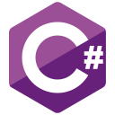
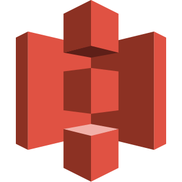

## Hi! 👋🏻 I'm Ferando Meirelles Brito :)

  
  
  
  

  
  

<!-- BIO:START -->

### Who am I?

<small>EN-US</small>

	
My name is Fernando Meirelles, I am 25 years old and I am currently studying Computer Engineering, in the 5th period. My goal is to become a highly qualified professional in the field I work in, and for that reason, I am always looking for ways to improve my knowledge and evolve as a professional. I believe that knowledge is a valuable asset and by investing in it, I can stand out in the job market.

In addition to my undergraduate course, I am dedicating myself to taking courses and participating in projects to improve my skills and knowledge. Currently, I am studying on platforms such as FlexPark, Alura, Rocketseat, Samsung Ocean, and Danki Code, where I learn techniques and tools to become a more complete developer.

I am interested in working on challenging projects that allow me to apply my skills and knowledge, and I am open to new opportunities that allow me to grow in my career. I believe that the combination of technical knowledge, teamwork, and creative thinking are fundamental to success in any field of work.

I hope to contribute to the success of your team and I am available to discuss more about my skills and experiences.

<small>PT-BR</small>

Meu nome é Fernando Meirelles, tenho 25 anos e atualmente estou cursando Engenharia da Computação, no 5º período. Meu objetivo é me tornar um profissional altamente qualificado na área em que atuo e, por isso, estou sempre buscando maneiras de melhorar meu conhecimento e evoluir como profissional. Acredito que o conhecimento é um ativo valioso e que, ao investir nele, posso me destacar no mercado de trabalho.

Além do meu curso de graduação, estou me dedicando a fazer cursos e participar de projetos para aprimorar minhas habilidades e conhecimentos. Atualmente, estou estudando em plataformas como FlexPark, Alura, Rocketseat, Samsung Ocean e Danki Code, onde aprendo técnicas e ferramentas para me tornar um desenvolvedor mais completo.

Tenho interesse em trabalhar em projetos desafiadores que me permitam aplicar minhas habilidades e conhecimentos, e estou aberto a novas oportunidades que me permitam crescer na carreira. Acredito que a combinação de conhecimento técnico, trabalho em equipe e pensamento criativo são fundamentais para o sucesso em qualquer área de atuação.

Espero poder contribuir para o sucesso da sua equipe e estou à disposição para discutir mais sobre minhas habilidades e experiências.
		

<!-- BIO:END -->

<!-- SKILLSET:START -->

## Technologies & Tools

<table align="center">

  <tr>
  <td align="center" width="50%" valign="top">

  ### Frontend

  
  
  
  <!--  -->
  
  
  <!--  -->
  <!--  -->
  <!--  -->
  <!--  -->
  <!--  -->
  <!--  -->

  </td>

  <td align="center" width="50%"  valign="top">

  ### Games

   
  <!-- 
   -->

  </td>
  </tr>

  <tr>
  <td align="center" valign="top">

  ### Backend

  
  
  <!--  -->
  <!--  -->
  <!--  -->
  
  <!--  -->
  <!--  -->
  <!--  -->
  <!--  -->
  <!--  -->
  
  

  </td>
  
  
  <td align="center" valign="top">

  ### Database

  
  
  
  
  <!--  -->
  </td>
  </tr>

  <tr>
  <td align="center" valign="top">

  ### Cloud & DevOps

  
  
  <!-- 
  
  
  
  
  
   -->

  </td>

  <td align="center" valign="top">

  ### Tools & IDEs

  
  
  <!--  -->
  
  <!--  -->
  <!-- 
  
  
   -->
  

  </td>
  </tr>
  <!-- <td align="center" valign="top"> -->

  <!-- ### Hardware

  
  
   -->

  
  <!-- <td align="center" valign="top"> -->

  <!-- ### AI

  
  
  
   -->

  

<!-- 
  <tr>
  <td align="center" valign="top">
  </td>

  </tr> -->

</table>

 

<!-- SKILLSET:END -->

<!-- STATS:START -->

    

    

    

<!-- STATS:END -->

 

<!-- CONTRIBUTION:END -->

<!-- VIEW-COUNT:END -->
